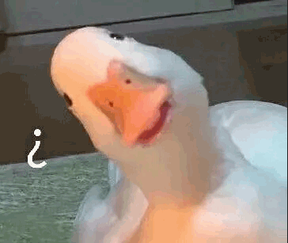

wu_program
==========  
  
这里主要存储一些前期的PETSc小程序，关键性的测试算例等。  

# 2018.10.10  
上传了4个程序
1. 2群中子稳态计算程序，均匀物质
2. 热工部分耦合计算算例
3. slepc中子本征值计算程序
4. PETSc矩阵读取例程  
这里需要注意的是：
注意每个文件的输入命令
 `test args: `

# 2018.10.11
学习了2个TS算例，对TS Object有一个大体的了解。  
上传了一个小程序，可以支持Matrix-Free以及Field Split PC  
在我的理解中就是JFNK方法再加上块Jacobi预处理  
可以借鉴该算例，修改耦合计算程序

# 2018.10.12
多文件C++程序处理  
目前效果不是很好，仅能实现把部分程序放入一个头文件中。  
可以参考  
[Multifiles](http://www.itkeyword.com/doc/5923142964970566764/creating-a-library-file-in-makefile-and-compiling-after-that)  
上述文档中说明了，如何把以及编译好的库文件链接到PETSc文件中。  
现在的问题是如何把自己的类或者函数封装为库文件，尤其是含有某些PETSc对象的函数，如何生成.o并生成lib？

# 2018.10.16
中子部分并行程序的修改，主要体现在以下不同：  
* keff变成一个物理场，但是由于这个物理场残差函数是每个网格都相同的，所以可以保证是一个均匀的物理场。
* 把FormFuntion变成区域计算，在每个处理器上只计算属于该处理器上的内容，这有可能涉及到映射点的问题。
* 程序中使用了DMCompositeScatter来获取局部向量，但是官方建议是使用`DMGlobalToLocal()` and `DMLocalToGlobal()` 来获得映射点。
* 有一个致命的问题：在计算keff的时候需要每个网格的信息，这是仅靠映射点以及不够了，应该如何处理？
